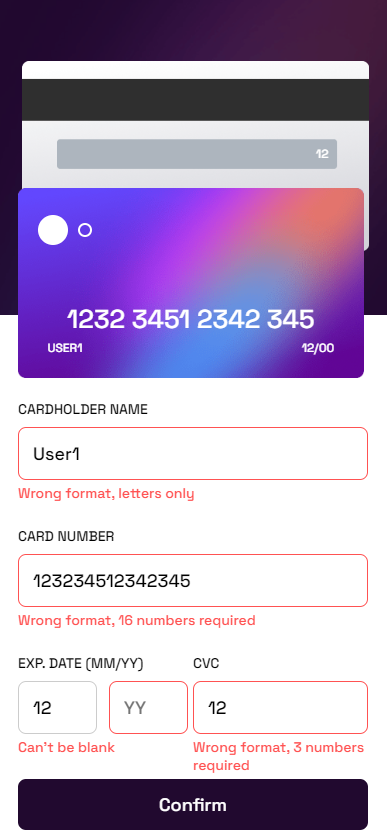

# Frontend Mentor - Interactive card details form

This is a solution to the [Interactive card details form challenge on Frontend Mentor](https://www.frontendmentor.io/challenges/interactive-card-details-form-XpS8cKZDWw). Frontend Mentor challenges help you improve your coding skills by building realistic projects. 

Welcome! 👋

## Table of contents

- [Overview](#overview)
  - [The challenge](#the-challenge)
  - [Screenshot](#screenshot)
  - [Links](#links)
- [My process](#my-process)
  - [Built with](#built-with)
  - [What I learned](#what-i-learned)
  - [Continued development](#continued-development)
  - [Useful resources](#useful-resources)
- [Author](#author)

## Overview

### The challenge

Users should be able to:

- Fill in the form and see the card details update in real-time
- Receive error messages when the form is submitted if:
  - Any input field is empty
  - The card number, expiry date, or CVC fields are in the wrong format
- View the optimal layout depending on their device's screen size
- See hover, active, and focus states for interactive elements on the page

### Screenshots

> - Desktop Version: 
>   - Errors: 
>   - Completed: 

> - Mobile Version: 
>   - Errors: 
>   - Completed: 

### Links

- Solution URL: [Challenge Interactive Card Details](https://github.com/drummes12/challenge_interactive_card_details)
- Live Site URL: [Interactive Card Details](https://example.com)

## My process

### Built with

- Semantic HTML5 markup
- CSS custom properties
- Flexbox
- CSS Grid
- Desktop-first workflow
- JavaScipt Vanilla
- [W3Schools](https://www.w3schools.com) - For styles

### What I learned

Reforce knowledge acquired in the basic and intermediate platzi courses, building coherent and scalable HTML, as well as trying to facilitate reading in styles and structure.

I learned the correct way to use the inputs of a form, and work with the states of this, in addition to the validation of the form by means of HTML, CSS and JavaScript.

### Continued development

From the forms I want to be able to collect and process the data from it in order to build a robust user registration application.

### Useful resources

- [W3Schools Documentation](https://www.w3schools.com) - This page helps me to understand the functionality of the styles, and which ones I can use to interact with.
- [Stackoverflow](https://es.stackoverflow.com) - The doubts that arise usually find their answer on this page, with a great community, many times the answers are already there, you just have to know how to ask.

## Author

- Website - [Esteban Gonzalez](https://drummes12.github.io/CV_Drummes12/)
- Github - [@drummes12](https://github.com/drummes12e)
- LinkedIn - [@drummes12](https://www.linkedin.com/in/drummes12/)